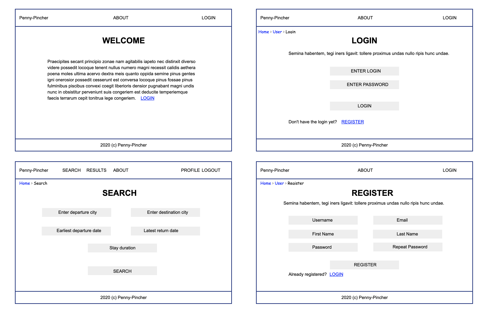
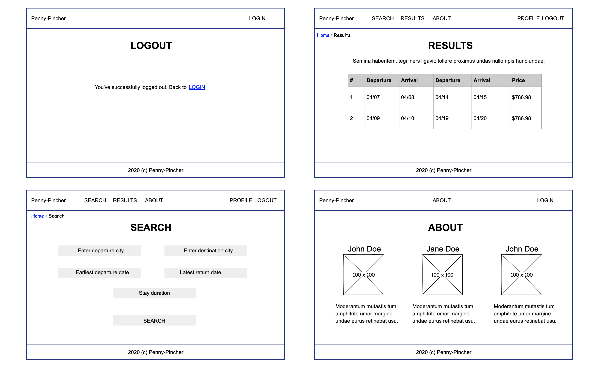
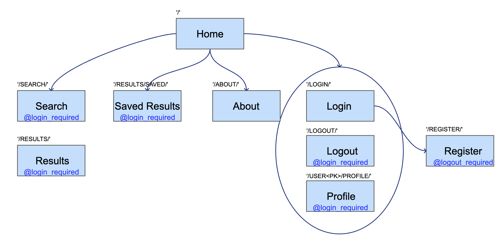
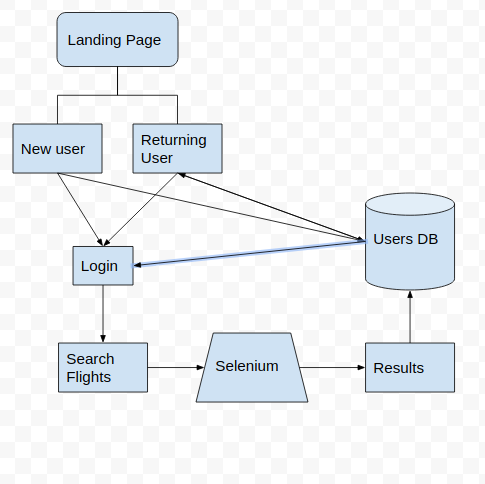
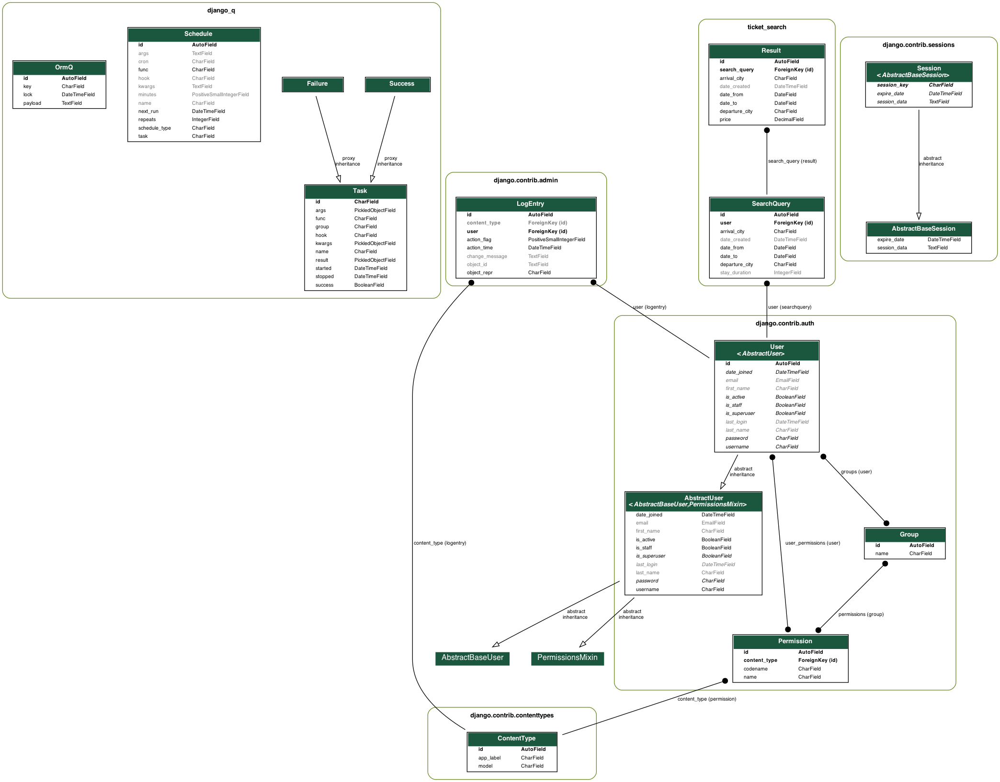

# PENNY-PINCHER

An app that helps user search for the cheapest possible flights within the given date range. Include in the search the airlines that don’t have APIs by utilizing Selenium and web scraping.

## AUTHORS

[_Leo Kukharau_](https://github.com/LeoKuhorev), [_Joseph Lee_](https://github.com/josephlee3454), [_Chuck Li Villalobos_](https://github.com/ticochuck)

## MVP LAYOUT WIREFRAME

## MVP ROUTES

## DOM

## GETTING STARTED:

- `poetry shell` to start your virtual environment
- `poetry install` to install dependencies
- create .env file with listed <a href="#env">below</a> variables and save it into 'penny_pincher' directory
- `python manage.py makemigrations` - to generate DB schema
- `python manage.py migrate` - to create DB schema
- `python manage.py createsuperuser` - to create user with admin access
- `python manage.py collectstatic` - to collect apps static files
- `python manage.py runserver` - to run server
- `python manage.py process_tasks` - to start background queue

If you're having troubles with installing `psycopg2` try this solution (for Mac users):  
`brew install openssl`  
`export LIBRARY_PATH=$LIBRARY_PATH:/usr/local/opt/openssl/lib/`  
`pip3 install psycopg2`

###  ENV variables:

SECRET_KEY=secret key for the app (typically 50-characters long string)  
DEBUG=should be set to True in development  
ALLOWED_HOSTS=localhost,127.0.0.1 (for testing)

## API:

`/` - landing page;  
`user/register/` - register page, handles user registration;  
`user/login/` - login page, allows a user to log in;  
`user/profile/` - profile page, allows a user to view and edit their profile information (login required);  
`user/logout/` - logout page, is shown when a user it logged out (login required);  
`search/` - search page, allows a user to submit new search request(login required);  
`delete_search/<search_id>/` - takes a search id and deletes it from DB (login required);  
`wait` - waiting page, is shown while the search results are being processed, also shows webscraped random fact of the day to entertain the user (login required, can only be accessed from the `search` page);  
`results/<search_id>/` - shows search results (login required);  
`delete_result/<result_id>/` - takes a result id and deletes it from DB (login required);  
`history/` - shows current user search history, allows deleting results (login required);  
`check_results/<search_id>/` - takes a search id and return whether or not the results are ready for the search request;  
`about/` - about us page;  
`admin/` - site admin page;

## Additional information:

[Requirements](./docs/requirements.md)  
[Workflow](./docs/workflow.md)  
[Project Management](https://github.com/401n1-midterm/penny-pincher/projects/1)

### DB Schema:

### Dependency Documentation:

[Python (v. 3.7.7)](https://docs.python.org/3.7/)  
[Django (v. 3.1)](https://docs.djangoproject.com/en/3.1/)  
[Selenium (v. 3.141.0)](https://pypi.org/project/selenium/)  
[Django Crispy Forms (v. 1.9.2)](https://pypi.org/project/django-crispy-forms/)  
[Django Environ (v. 0.4.5)](https://pypi.org/project/django-environ/)  
[Gunicorn (v. 20.0.4)](https://pypi.org/project/gunicorn/)  
[Psycopg2-binary (v. 2.8.5)](https://pypi.org/project/psycopg2-binary/)  
[Psycopg2 (v. 2.8.5)](https://pypi.org/project/psycopg2/)  
[Django-Heroku (v. 0.3.1)](https://pypi.org/project/django-heroku/)  
[Django Background Tasks (v. 1.2.5)](https://pypi.org/project/django-background-tasks/)  
[BeautifulSoup4 (v. 4.9.1)](https://pypi.org/project/beautifulsoup4/)  
[Lxml (v. 4.5.2)](https://pypi.org/project/lxml/)  
[Requests (v. 2.24.0)](https://pypi.org/project/requests/)

### Dev Dependencies:

[Pylint-Django (v. 2.3.0)](https://pypi.org/project/pylint-django/)
